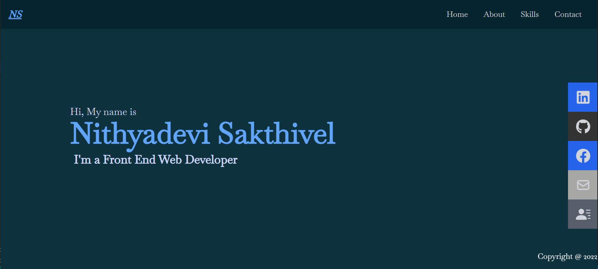

# React-Portfolio-Project

## About Me

Hi I'm Nithi, I am looking for a career change, So decided to do the front end web development course - Academy Xi.

A graduate front-end web developer located in Sydney. I'm looking for a job opportunity as I have serious passion for creative web development. Well-Organised person, problem solver with high attention to details.
Interested in the entire frontend spectrum and looking for ambitious project with positive people.

## Build With		

HTML

CSS

JavaScript

React

## Pre-requisite

NPM

React, React DOM, React Router DOM and React Icons

Parcel

Webpack

Tailwind

## To Start Server
npm start
